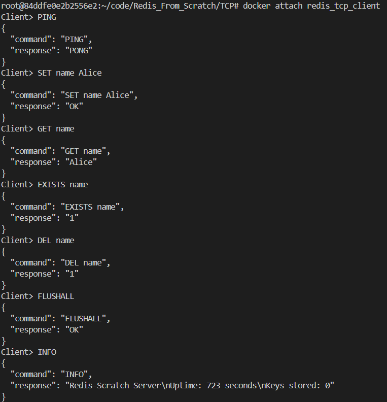
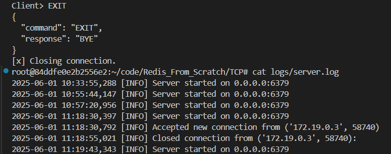

## Lab 1: Build a Redis-like TCP Server in Python

### What is TCP?

**TCP (Transmission Control Protocol)** is a **reliable, connection-oriented** protocol that allows servers to communicate with multiple clients safely.

**Key Features:**

- Reliable (no data loss)
- Ordered data transfer
- Full-duplex communication
- Used by Redis, HTTP, FTP, etc.

---

### Why Does Redis Use TCP?

Redis uses TCP because:

- It ensures **reliable and ordered** delivery of commands and responses.
- Multiple clients can **safely connect and interact** with the Redis server.
- Unlike UDP, TCP guarantees **data integrity and delivery**.

---

### Objectives

Lab 1 focuses on building the foundational components of a Redis-like server. The three main tasks include:

1. **Creating a TCP server using Python's `socket` module**
2. **Handling multiple client connections (multi-client support)**
3. **Implementing a basic REPL loop for processing commands like `SET` and `GET`**

---

### What Was Done:

#### 1. **TCP Server using `socket` Module**

- A server was implemented using Python's built-in `socket` module.
- Listens on port `6379` (like Redis).
- Accepts connections and reads commands from clients.

#### 2. **Multi-Client Handling**

- The server can handle multiple clients concurrently using a `select` loop.
- Each client has its own connection but shares a common in-memory key-value store.

#### 3. **REPL (Read–Eval–Print Loop) Command Processing**

- Supports Redis-like command structure:
  - `PING`
  - `SET key value`
  - `GET key`
- Responses are provided in JSON format in the client.

---

### Running the Project

**Steps to Run:**

   - **Step 1: Navigate to Project Folder**
     ```bash
     cd TCP
     ```

   - **Step 2: Start Docker Compose**
     ```bash
     docker-compose up --build -d
     ```
     **OutPut**
     ```
      ✔ Network tcp_redis_network   Created                                  
      ✔ Container redis_tcp_server  Started                                  
      ✔ Container redis_tcp_client  Started                                
     ```
   - **Step 3: Service log check**
     ```
      docker-compose logs tcp-client
     ```
     **OutPut**
      ```
      redis_tcp_client  | [+] Connected to TCP server at tcp-server:6379
      redis_tcp_client  | [i] JSON Output: ON
      ```

   - **Step 4: Interact with Client**
     ```bash
     docker attach redis_tcp_client
     ```
     - Type commands like `PING`, `SET name Alice`, `GET name`, etc.
    
      **OutPut**
    
     
 


   - **Step 5: Stop the Server**
     ```bash
     docker-compose down
     ```

## Multiple Client Testing 

###  Terminal 1: Client 1

```bash
$ telnet localhost 6379
```

```json
{
  "command": "SET user1 Alice",
  "response": "OK"
}
```

```json
{
  "command": "GET user1",
  "response": "Alice"
}
```

---

### Terminal 2: Client 2

```bash
$ telnet localhost 6379
```

```json
{
  "command": "SET user2 Bob",
  "response": "OK"
}
```

```json
{
  "command": "GET user2",
  "response": "Bob"
}
```

```json
{
  "command": "GET user1",
  "response": "Alice"
}
```

---

* **SET** and **GET** work independently per client, yet reflect globally stored values.
* This confirms that your server supports **multiple concurrent clients** with consistent data access.