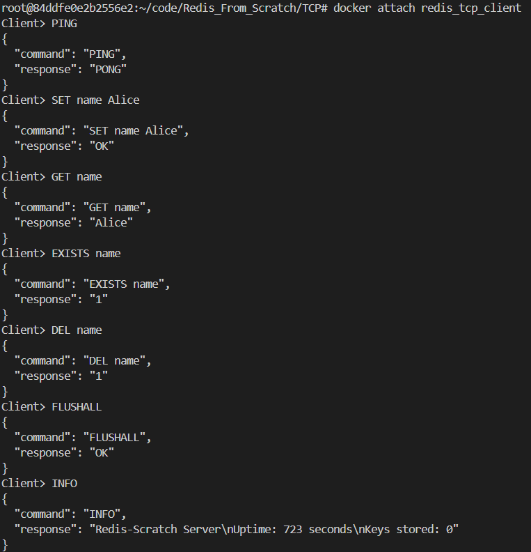
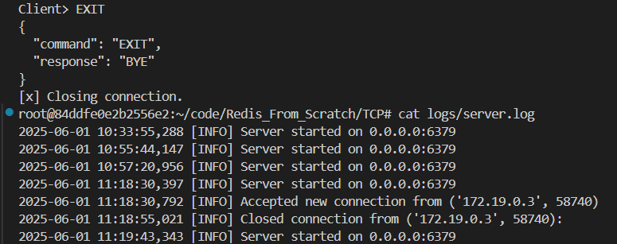

## Lab 1: Build a TCP Server in Python

### What is TCP?

**TCP (Transmission Control Protocol)** is a **reliable, connection-oriented** protocol that allows servers to communicate with multiple clients safely.

**Key Features:**

- Reliable (no data loss)
- Ordered data transfer
- Full-duplex communication
- Used by Redis, HTTP, FTP, etc.

---

### Why Does Redis Use TCP?

Redis uses TCP because:

- It ensures **reliable and ordered** delivery of commands and responses.
- Multiple clients can **safely connect and interact** with the Redis server.
- Unlike UDP, TCP guarantees **data integrity and delivery**.

---

### Objectives

Lab 1 focuses on building the foundational components of a Redis-like server. The three main tasks include:

1. **Creating a TCP server using Python's `socket` module**
2. **Handling multiple client connections (multi-client support)**
3. **Implementing a basic REPL loop for processing commands like `SET` and `GET`**

---
# Workflow Diagram: 


This diagram shows a **non-blocking, event-driven TCP server** that handles multiple clients using a **single thread**.

1. The server listens on port 6379 using the `socket` module and accepts multiple client connections.

2. Clients send simple commands like `SET name Alice` or `GET name`. The server processes these and responds with values or "OK", like a REPL.

3. The server uses Python's `selectors` module to monitor all client sockets for I/O events (like incoming data). Instead of blocking on each socket, it reacts only when data is ready—efficiently handling many clients at once. This event-driven loop allows a single thread to serve multiple clients concurrently without using threads or processes, keeping the system lightweight and responsive.


## File Descriptions

| File                 | Purpose                                                        |
| -------------------- | -------------------------------------------------------------- |
| `server.py`          | Main TCP server implementing Redis-like commands               |
| `client.py`          | CLI-based TCP client for sending commands to the server        |
| `Dockerfile`         | Docker image setup for the TCP server                          |
| `docker-compose.yml` | Docker service configuration to run the server                 |
| `logs/server.log`    | Log file auto-generated for server events and command activity |

---

## Commands Supported by the Server

| Command    | Description                          |
| ---------- | ------------------------------------ |
| `SET`      | Stores the key with the given value  |
| `GET`      | Retrieves the value for a key        |
| `DEL`      | Deletes a key                        |
| `EXISTS`   | Checks if a key exists               |
| `PING`     | Health check                         |
| `INFO`     | Returns server uptime and total keys |
| `FLUSHALL` | Deletes all keys                     |
| `EXIT`     | Disconnects client from the server   |
---


### Running the Project

**Steps to Run:**

   - **Step 1: Navigate to Project Folder**
     ```bash
     cd TCP
     ```

   - **Step 2: Start Docker Compose**
     ```bash
     docker-compose up --build -d
     ```
     **OutPut**
     ```
      ✔ Network tcp_redis_network   Created                                  
      ✔ Container redis_tcp_server  Started                                  
      ✔ Container redis_tcp_client  Started                                
     ```
   - **Step 3: Service log check**
     ```
      docker-compose logs tcp-client
     ```
     **Output**
     ```
      redis_tcp_client  | [+] Connected to TCP server at tcp-server:6379
      redis_tcp_client  | [i] JSON Output: ON
      ```

   - **Step 4: Interact with Client**
     ```bash
     docker attach redis_tcp_client
     ```
   - **Step 5: Type commands like `PING`, `SET name Alice`, `GET name`, etc.**

     **Output** 

     
      
    

   - **Step 6: Stop the Server**
     ```bash
     docker-compose down 
     ```

## DONE

